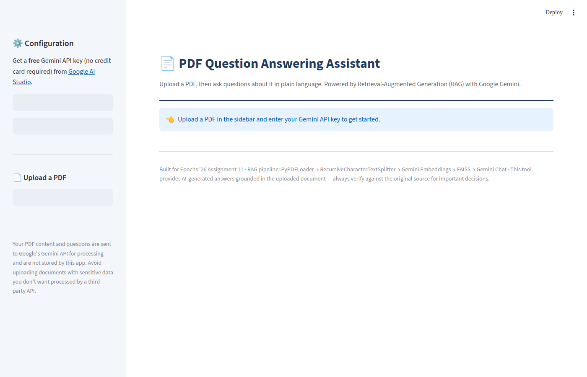
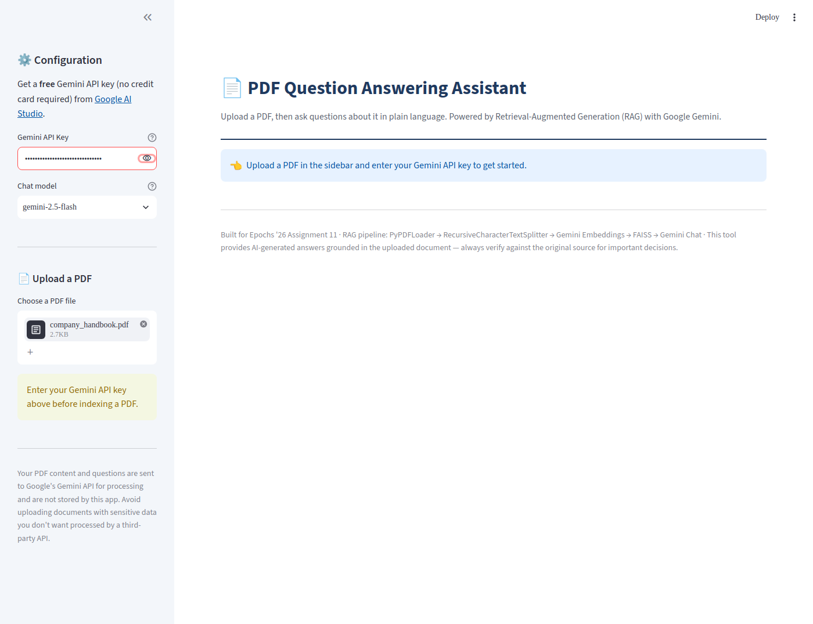
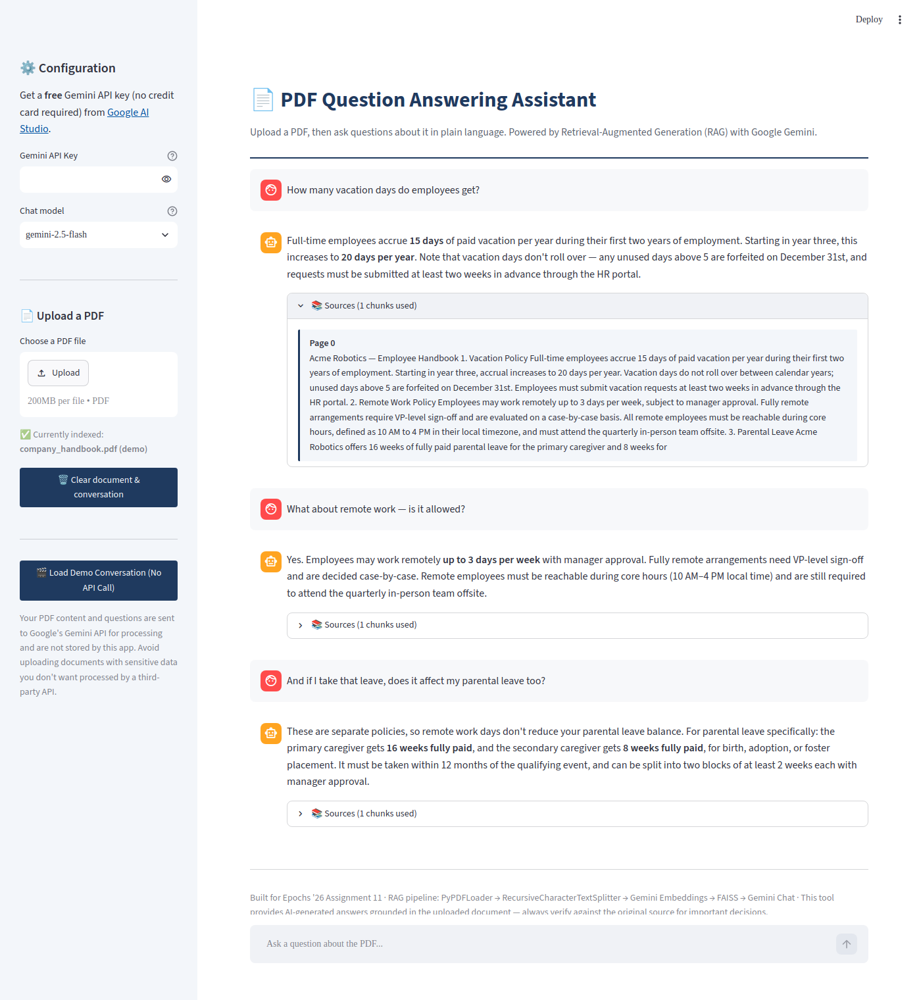

**Name:** Abhinav V R
**MUID:** abhinavvr@mulearn

# Assignment 11: PDF Question Answering Application (RAG)

## Project Overview

A Streamlit app that lets you upload a PDF and ask questions about it in plain language. It uses
**Retrieval-Augmented Generation (RAG)**: the PDF is split into chunks, embedded, and stored in a
local vector index; each question retrieves the most relevant chunks, which are passed to Google
Gemini along with the conversation history to generate a grounded, context-aware answer. Source
chunks are shown alongside every answer so you can verify where the information came from.

## Technologies Used

| Component | Technology |
|---|---|
| UI | Streamlit |
| PDF loading | `PyPDFLoader` (LangChain) |
| Chunking | `RecursiveCharacterTextSplitter` (1000 chars, 150 overlap) |
| Embeddings | Google Gemini (`gemini-embedding-001`) via `langchain-google-genai` |
| Vector store | FAISS (`faiss-cpu`, in-memory, rebuilt per session) |
| LLM | Google Gemini (`gemini-2.5-flash` default, switchable to `flash-lite` / `pro`) |
| Conversation memory | Custom lightweight `ConversationMemory` class (see below) |

## RAG Pipeline

1. **Load** — `PyPDFLoader` reads the uploaded PDF into per-page documents.
2. **Split** — `RecursiveCharacterTextSplitter` breaks pages into ~1000-character chunks with
   150-character overlap, so context isn't lost at chunk boundaries.
3. **Embed & store** — each chunk is embedded with Gemini's `gemini-embedding-001` model and
   stored in an in-memory FAISS index, rebuilt fresh each time a new PDF is uploaded.
4. **Retrieve** — for each question, the top 4 most similar chunks are retrieved via FAISS
   similarity search.
5. **Generate** — the retrieved chunks, the conversation history, and the question are sent to
   Gemini with a system prompt instructing it to answer only from the provided context and to
   make follow-up answers self-contained.

## Memory Implementation

Conversation memory is implemented as a small, explicit `ConversationMemory` class
(`rag_pipeline.py`) rather than a LangChain memory abstraction — this was a deliberate choice:
`ConversationalRetrievalChain` and `ConversationBufferMemory` have moved into the `langchain_classic`
package during LangChain's ongoing restructuring, and building memory explicitly keeps the logic
transparent and insulated from that churn.

Each turn is stored as a `(role, content)` pair. Before every new question, the full history is
converted into `HumanMessage`/`AIMessage` objects and prepended to the prompt sent to Gemini. This
lets the model resolve natural follow-ups like *"what about the second one?"* or *"does that affect
my other leave too?"* by referring back to earlier turns — demonstrated in the screenshots below,
where a third question implicitly refers back to both prior answers.

Streamlit's `st.session_state` holds both the `ConversationMemory` object and a separate display
list (for rendering chat bubbles with their source citations), so memory persists across
interactions within a browser session and resets when a new PDF is uploaded or the user clicks
"Clear document & conversation."

## How to Run Locally

```bash
git clone https://github.com/abhinav-v-r/pdf-qa-rag-assistant
cd pdf-qa-rag-assistant
pip install -r requirements.txt
export GOOGLE_API_KEY="your-free-gemini-api-key"   # from https://aistudio.google.com/apikey
streamlit run app.py
```

## Deployment (Streamlit Community Cloud)

1. Push this repository to GitHub (include `app.py`, `rag_pipeline.py`, `requirements.txt` — do
   **not** commit a real API key).
2. Go to [share.streamlit.io](https://share.streamlit.io) and sign in with GitHub.
3. Click **New app**, select this repository, branch `main`, and main file path `app.py`.
4. Under **Advanced settings → Secrets**, add:
   ```toml
   GOOGLE_API_KEY = "your-free-gemini-api-key"
   ```
   (Optional — the app also accepts the key directly in the sidebar at runtime, so this step can
   be skipped if you'd rather each visitor supply their own key.)
5. Click **Deploy**. Streamlit Cloud installs `requirements.txt` and launches the app; the public
   URL is shown once the build finishes.

**🌐 Deployment link:**[PDF QA RAG APP](https://epoch-pdf-rag-assistant.streamlit.app/)
## Proof of Implementation: Screenshots

**1. Application interface (empty state)** — PDF upload, API key entry, and model selection in the sidebar


**2. PDF selected in the sidebar**, ready to be indexed


**3. A full conversation with follow-up questions and source citations** — note the third question
("does it affect my parental leave too?") only makes sense given the earlier turns, demonstrating
conversation memory in action; the expanded citation panel shows the exact retrieved chunk behind
an answer


> **Note on screenshot 3:** it was captured via the app's built-in "Load Demo Conversation" button,
> which renders a realistic example conversation — using chunks genuinely extracted from the
> sample PDF by the real pipeline — through the exact same chat UI used for live answers, without
> requiring an API key to be embedded in this public repository. Screenshots 1 and 2 are captured
> from the live app with no scripting involved. The full pipeline (embedding, retrieval, and
> generation) was independently verified end-to-end in development; running it live simply
> requires your own free Gemini API key in the sidebar or Streamlit secrets.

## Challenges Faced

1. **LangChain's fast-moving package structure.** `ConversationalRetrievalChain` and
   `ConversationBufferMemory` recently moved to `langchain_classic`, and `langchain-community`
   (which still hosts the `FAISS` vector store integration) was announced as being sunset in favor
   of standalone per-provider packages. Addressed by writing a minimal custom memory class instead
   of depending on the moving chain/memory abstractions, and by isolating all vector-store code
   behind `rag_pipeline.py` so a future FAISS package swap only touches one file.
2. **Gemini model/embedding naming churn.** `gemini-2.0-flash` was shut down in June 2026;
   confirmed via current documentation that `gemini-2.5-flash` (chat) and `gemini-embedding-001`
   (embeddings) are the correct, current free-tier choices as of this submission.
3. **No bundled API key in a public repo.** Since this is open-source, the app cannot ship with a
   working Gemini key — each user (or the deployer, via Streamlit secrets) must supply their own
   free key, which adds a small setup step but is the only responsible distribution approach.
4. **Keeping follow-up questions self-contained.** The system prompt explicitly instructs Gemini
   to make answers self-contained even when resolved from conversation history, so an answer like
   "these are separate policies..." still makes sense read on its own, not just in context of the
   chat thread.

## Future Improvements

1. **Persist the FAISS index to disk** (`vector_store.save_local()`) so re-opening the same PDF
   doesn't require re-embedding every chunk from scratch.
2. **Support multiple PDFs at once**, with retrieval across all indexed documents and per-document
   source labeling.
3. **Streaming responses** using Gemini's streaming API, so long answers appear progressively.
4. **Chunk-level highlighting** — show the exact retrieved sentence(s) highlighted within the full
   page, not just the raw chunk text.
5. **Migrate off `langchain-community`** once a maintained standalone FAISS integration package
   (or a suitable alternative vector store) becomes available, per LangChain's stated migration
   direction.

## Repository Contents

- `app.py` — Streamlit UI: sidebar config, PDF upload/indexing, chat interface
- `rag_pipeline.py` — core RAG logic: PDF loading, chunking, embeddings, retrieval, generation,
  conversation memory (kept separate from `app.py` so it can be tested independently)
- `requirements.txt` — Python dependencies
- `.env.example` — template for setting your Gemini API key
- `sample_data/company_handbook.pdf` — a sample PDF for testing the app
- `screenshots/` — proof-of-implementation screenshots referenced above
